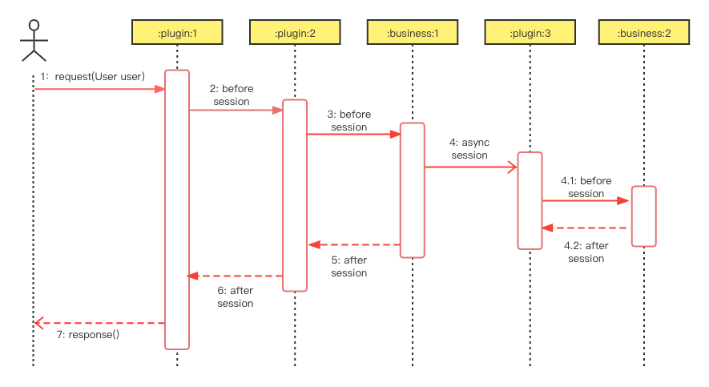
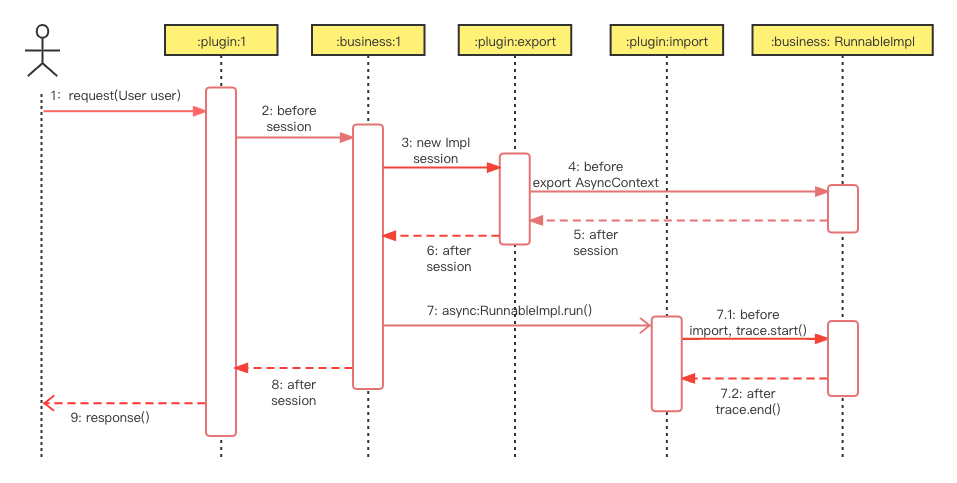

#  Context

Between plugin and plugin, there is data transfer, such as jdbc uri, span and key, etc.

In order to solve the problem of data transmission, EaseAgent provides a session-level Context. 

### What is a session-level context?
Context shared in the same session in the same process

Definition of "same session":
In the same thread, from a request to the end of the response, all belong to the same session.
In the case of cross-threading, from a request to the request thread resource operation, to the end of the entire response, all belong to the same session



### Session-level Context features:

1. The same session, data sharing between different plugins
2. When the session has a cross-thread request, a "plugin" is required to ensure effective data transfer



This Context is passed in the before and after method parameters of Interceptor.

```
interface Interceptor{
    void before(..., Context context);
    void after(..., Context context)
}
```

## Context API

[com.megaease.easeagent.plugin.api.Context](../plugin-api/src/main/java/com/megaease/easeagent/plugin/api/Context.java)

```java
package com.megaease.easeagent.plugin.api;

import com.megaease.easeagent.plugin.api.config.Config;
import com.megaease.easeagent.plugin.api.context.AsyncContext;
import com.megaease.easeagent.plugin.api.trace.*;

/**
 * A Context remains in the session it was bound to until business finish.
 */
public interface Context {
    /**
     * When true, do nothing and nothing is reported . However, this Context should
     * still be injected into outgoing requests. Use this flag to avoid performing expensive
     * computation.
     */
    boolean isNoop();

    /**
     * Returns the most recently created tracing component iff it hasn't been closed. null otherwise.
     *
     * <p>This object should not be cached.
     */
    Tracing currentTracing();

    /**
     * Returns the value to which the specified key is mapped,
     * or {@code null} if this context contains no mapping for the key.
     *
     * <p>More formally, if this context contains a mapping from a key
     * {@code k} to a value {@code v} such that {@code (key==null ? k==null :
     * key.equals(k))}, then this method returns {@code v}; otherwise
     * it returns {@code null}.  (There can be at most one such mapping.)
     *
     * <p>If this context permits null values, then a return value of
     * {@code null} does not <i>necessarily</i> indicate that the context
     * contains no mapping for the key; it's also possible that the context
     * explicitly maps the key to {@code null}.
     *
     * @param key the key whose associated value is to be returned
     * @return the value to which the specified key is mapped, or
     * {@code null} if this context contains no mapping for the key
     * @throws ClassCastException if the key is of an inappropriate type for
     *                            this context
     *                            (<a href="{@docRoot}/java/util/Collection.html#optional-restrictions">optional</a>)
     */
    <V> V get(Object key);

    /**
     * Removes the mapping for a key from this Context if it is present
     * (optional operation).   More formally, if this context contains a mapping
     * from key <tt>k</tt> to value <tt>v</tt> such that
     * <code>(key==null ?  k==null : key.equals(k))</code>, that mapping
     * is removed.  (The context can contain at most one such mapping.)
     *
     * <p>Returns the value to which this context previously associated the key,
     * or <tt>null</tt> if the context contained no mapping for the key.
     *
     * <p>If this context permits null values, then a return value of
     * <tt>null</tt> does not <i>necessarily</i> indicate that the context
     * contained no mapping for the key; it's also possible that the context
     * explicitly mapped the key to <tt>null</tt>.
     *
     * <p>The context will not contain a mapping for the specified key once the
     * call returns.
     *
     * @param key key whose mapping is to be removed from the Context
     * @return the previous value associated with <tt>key</tt>, or
     * <tt>null</tt> if there was no mapping for <tt>key</tt>.
     * @throws ClassCastException if the key is of an inappropriate type for
     *                            this context
     *                            (<a href="{@docRoot}/java/util/Collection.html#optional-restrictions">optional</a>)
     */
    <V> V remove(Object key);

    /**
     * Associates the specified value with the specified key in this context
     * (optional operation).  If the context previously contained a mapping for
     * the key, the old value is replaced by the specified value.  (A context
     * <tt>m</tt> is said to contain a mapping for a key <tt>k</tt>
     *
     * @param key   key with which the specified value is to be associated
     * @param value value to be associated with the specified key
     * @return the previous value associated with <tt>key</tt>, or
     * <tt>null</tt> if there was no mapping for <tt>key</tt>.
     * (A <tt>null</tt> return can also indicate that the context
     * previously associated <tt>null</tt> with <tt>key</tt>,
     * if the implementation supports <tt>null</tt> values.)
     * @throws ClassCastException if the class of the specified key or value
     *                            prevents it from being stored in this context
     */
    <V> V put(Object key, V value);

    /**
     * Looks at the config at the current without removing it
     * from the stack.
     *
     * @return The config at the top of this stack (the last config of the <tt>Config</tt> object).
     * return {@link com.megaease.easeagent.plugin.bridge.NoOpConfig#INSTANCE} if this stack is empty.
     */
    Config getConfig();

    /**
     * Record and return the stacking sequence of Object{@code key}'s Session
     * It needs to be used together with the {@link #exit(Object)} to be effective
     * for example 1:
     * <pre>{@code
     *      fun1(){
     *          try{
     *              if (context.enter(obj)!=1){
     *                 return;
     *              }
     *              //do something1
     *          }finally{
     *              if (context.exit(obj)!=1){
     *                 return;
     *              }
     *              //do something2
     *          }
     *      }
     *      fun2(){
     *          try{
     *              if (context.enter(obj)!=1){
     *                 return;
     *              }
     *              // call fun1();
     *              //do something3
     *          }finally{
     *              if (context.exit(obj)!=1){
     *                 return;
     *              }
     *              //do something4
     *          }
     *      }
     * }</pre>
     * if call fun2(), something1 and something2 will no longer execute
     * <p>
     * for example 2:
     *
     * <pre>{@code
     *      fun1(){
     *          try{
     *              if (context.enter(obj)>2){
     *                 return;
     *              }
     *              //do something1
     *          }finally{
     *              if (context.exit(obj)>2){
     *                 return;
     *              }
     *              //do something2
     *          }
     *      }
     *      fun2(){
     *          try{
     *              if (context.enter(obj)>2){
     *                 return;
     *              }
     *              // call fun1();
     *              //do something3
     *          }finally{
     *              if (context.exit(obj)>2){
     *                 return;
     *              }
     *              //do something4
     *          }
     *      }
     *      fun3(){
     *          try{
     *              if (context.enter(obj)>2){
     *                 return;
     *              }
     *              // call fun2();
     *              //do something5
     *          }finally{
     *              if (context.exit(obj)>2){
     *                 return;
     *              }
     *              //do something6
     *          }
     *      }
     * }</pre>
     * if call fun3(), something1 and something2 will no longer execute
     *
     * @param key the Object of stacking sequence
     * @return stacking sequence
     * @see #exit(Object)
     */
    int enter(Object key);

    /**
     * Record and verify the stacking sequence of Object{@code key}'s Session
     * It needs to be used together with the {@link #exit(Object, int)} to be effective
     *
     * @param key   the Object of stacking sequence
     * @param times the verify of stacking sequence
     * @return true if stacking sequence is {@code times} else false
     * @see #enter(Object)
     */
    default boolean enter(Object key, int times) {
        return enter(key) == times;
    }

    /**
     * Release and return the stacking sequence of Object{@code key}'s Session
     * It needs to be used together with the {@link #enter(Object)} to be effective
     *
     * @param key the Object of stacking sequence
     * @return stacking sequence
     * @see #enter(Object)
     */
    int exit(Object key);

    /**
     * Release and verify the stacking sequence of Object's Session
     * It needs to be used together with the {@link #enter(Object, int)} to be effective
     *
     * @param key   the Object of stacking sequence
     * @param times the verify of stacking sequence
     * @return true if stacking sequence is {@code times} else false
     * @see #exit(Object)
     */
    default boolean exit(Object key, int times) {
        return exit(key) == times;
    }


    //---------------------------------- 1. async ------------------------------------------
    /**
     * Export a {@link AsyncContext} for asynchronous program processing
     * It will copy all the key:value in the current Context
     *
     * @return {@link AsyncContext}
     */
    AsyncContext exportAsync();

    /**
     * Import a {@link AsyncContext} for asynchronous program processing
     * It will copy all the key: value to the current Context
     * <p>
     * If you don’t want to get the Context, you can use the {@link AsyncContext#importToCurrent()} proxy call
     *
     * @param snapshot the AsyncContext from {@link #exportAsync()} called
     * @return {@link Scope} for tracing
     */
    Scope importAsync(AsyncContext snapshot);

    /**
     * Wraps the input so that it executes with the same context as now.
     */
    Runnable wrap(Runnable task);

    /**
     * Check task is wrapped.
     *
     * @param task Runnable
     * @return true if task is warpped.
     */
    boolean isWrapped(Runnable task);

    /**
     * @return true if the key is necessary for EaseAgent
     */
    boolean isNecessaryKeys(String key);

    /**
     * Inject Forwarded Headers key:value to Setter {@link Setter#setHeader(String, String)}.
     *
     * @param setter key:value to
     * @see Request#setHeader(String, String)
     */
    void injectForwardedHeaders(Setter setter);

    /**
     * Import Forwarded Headers key:value to Context {@link Getter#header(String)}.
     *
     * @param getter name from
     * @see Request#header(String)
     */
    void importForwardedHeaders(Getter getter);
}

```
